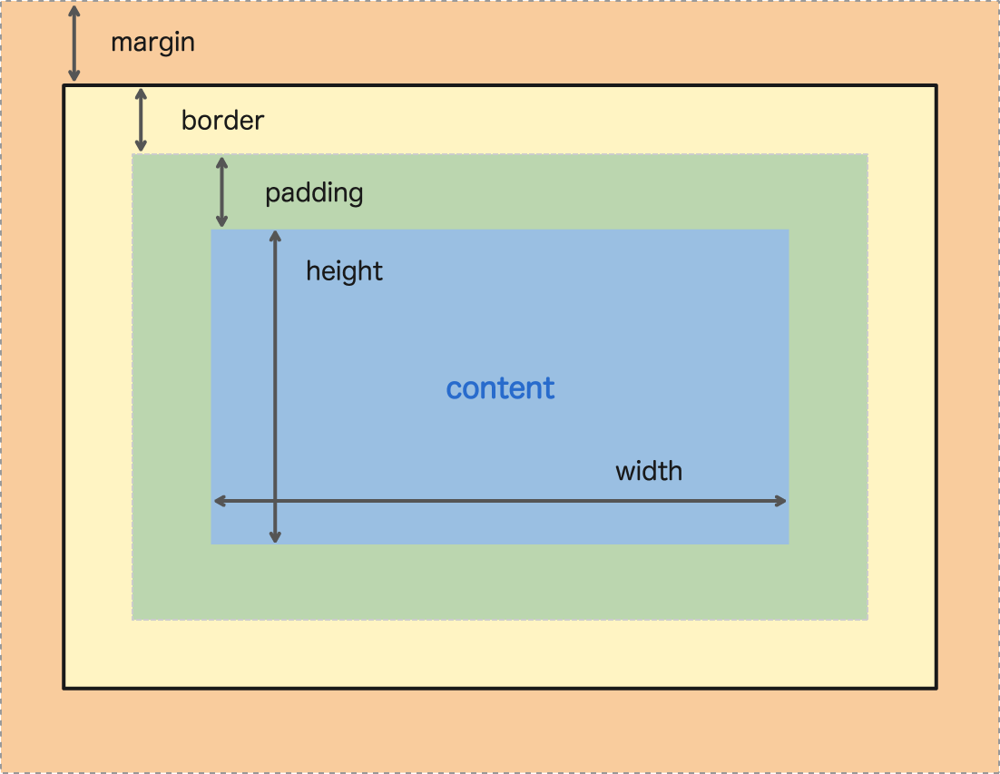

Momentum 만들기
===

일단 따라해보는 웹페이지 만들기 #2
---

목차
---
- Css란?
- html class 추가하기
- 배경 이미지 추가하기
- css의 여러가지 단위
- flex box
- box model

Css란?
---
(**Cascading Style Sheets**) 단순히 칙칙한 html을 꾸며주기 위한 도구이다. 태그들로 이루어진 html에서 해당 태그를 불러와서 속성값을 넣어주면 되는것이다.  
예를 들어 body태그안에 글자 색을 흰색으로 변경하고 싶을때
```css
body: {
    color: white;
}
```
이런식으로 작성해주면 된다. 하지만 태그는 같은 종류를 여러번 사용할 수 있기 때문에 특정 태그를 불러오기 위해서 class를 이용한다.
html 태그의 속성에 class를 부여하고 class이름이 weather일 때 불러오는 방법이다.
```css
.weather {
    color: black;
}
```
class이름 앞에 .을 붙여주면 된다.

html class 추가하기
---
html 태그 안에 class="이름" 으로 속성값을 넣어주면 된다. 곂치는 태그들에 대해서만 정해주면 된다.  

```html
<div class="weather">
    <div class="status">
        <div class="weather_icon mdi"></div>
        <div class="temperature"></div>
    </div>
    <div class="location"></div>
</div>
```
이런식으로 div에 해당하는 것들에 대해 class를 지정해 주었다. 두가지 이상의 class를 지정해줄 수도 있는데 띄어쓰기로 구분해서 넣어주면 된다.

배경 이미지 추가하기
---
웹페이지 전체에 대해서 배경 이미지를 추가하려 한다. 이미지는 무료이미지 사이트인 unsplash에서 무작위로 가져오기로 한다. body의 background에 image를 넣어주기 위해 이미지의 주소를 넣어준다.
```css
body {
    background-image: url("https://source.unsplash.com/category/nature");
}
```
body의 크기가 생각처럼 전체크기가 아니어서 전체크기로 바꿔준다. 단위에 대한건 잠시 후 설명하겠다.
```css
body {
    height: 100vh;
}
```
이미지가 반복적으로 나타나지 않게 하기 위해 repeat을 no-repeat으로 바꿔준다.
```css
body {
    background-repeat: no-repeat;
}
```
이미지의 사이즈를 화면에 꽉차게 하기위해 size를 cover로 바꾸고 이미지의 중간부분을 보여주기 위해 position을 center로 attachment를 fixed로 변경해준다.
```css
body {
    background-size: cover;
    background-position: center;
    background-attachment: fixed;
}
```

css의 여러가지 단위
---
css에서 여러 수치를 입력해줄 때 쓰이는 단위의 종류는 여러가지가 있다.
단위|사용
:---:|:---:
px|고정적인 수치를 입력해야할 때 사용 (**권장하지 않음**)
%|부모 태그(현재 태그를 감싸고 있는 태그) 기준으로 상대적인 수치 1/100 단위
vh|브라우저 높이에 대해 상대적인 수치 1/100 단위
vw|브라우저 너비에 대해 상대적인 수치 1/100 단위
vmax | 브라우저에서 높이와 너비중 큰 값 1/100 단위
vmin | 브라우저에서 높이와 너비중 작은 값 1/100 단위
em|폰트 사이즈 적용할 때 부모 태그 기준 폰트 사이즈, 그 외는 자신 태그의 폰트 사이즈 기준
rem|root 폰트 사이즈 기준 (16px)

flex box
---
html의 내용을 구조적으로 잘 표현하기 위해 layout을 잘 구현해야한다. flex box라는 것이 존재하기 이전에는 css로 구조를 잡기가 어려웠으나 flex box를 알고나면 쉽게 구현할 수 있다.  
flex box는 container가 item들을 어느곳에 배치할지 결정할 수 있는 속성이다. 따라서 container에게 flex box를 적용해주는 것으로 시작할 수 있다.
```css
body {
    display: flex;
}
```
display값을 flex로 설정한다. 그러면 자동으로 item들이 가로방향 `row` 로 정렬이된다. 방향을 결정하는 속성은 `flex-direction`이다. 지금은 body에 속한 item들을 세로방향으로 배치해야하기 때문에 `column`으로 설정한다.  
flex는 배치 방향으로 하나의 축이 생겼다고 생각하면 쉽다. 오뎅꼬치에 꽃혀있는 오뎅이라고 생각하면 좋다. 오뎅꼬치를 container 오뎅을 item 이라고 했을 때 꼬치는 가만히 있고 오뎅의 위치를 결정하는 것이 `justify-content`속성이다. 오뎅의 위치는 가만히 있고 꼬치의 위치를 결정하는 속성은 `align-items`이다. 이 두가지 속성을 이용해서 여러 배치를 만들어 낼 수 있다.  
추가적으로 item들의 크기를 결정할 때 container에서 특정 비중을 차지해야 할 경우 `flex`속성을 부여해서 특정 비중만큼 차지하도록 할 수 있다.

box model
---
모든 태그들은 박스형태로 공간을 차지하게 된다. 

해당 태그는 내용을 품고 있는데 내용과 태그와의 간격을 `padding` 태그와 다른 태그와의 간격을 `margin` 속성을 이용해서 정해줄 수 있다. 이때 이런 간격은 보통 내용의 글씨 크기와 연관이 있기 때문에 em단위를 이용해서 작성해주는 것이 반응형으로의 첫 걸음이라고 볼 수 있다.