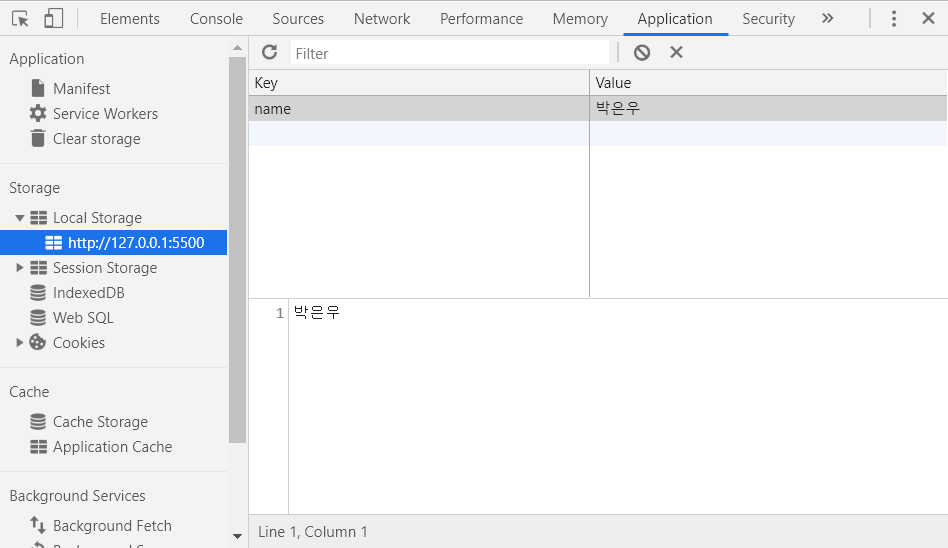

Momentum 만들기
===

일단 따라해보는 웹페이지 만들기 #3
---

목차
---
- html dom 객체
- setInterval
- localStorage
- fetch & async

html dom 객체
---
css에서 html의 태그를 불러왔듯이 자바스크립트도 html의 내용을 변경시키려면 가져와야한다. css를 위해서 class 속성을 부여했는데 javascript를 위해선 id 속성을 부여하면된다.
```javascript
document.getElementById('아이디');
```
이렇게 가져와서 변수에 저장해두면 된다. 변수를 선언할 때는 타입을 신경쓰지 않고 const로 선언해주면 되는데 해당 변수에 = 연산을 해야할 일이 생긴다면 let으로 바꿔주면 된다.

setInterval
---
시간을 보여주기 위해서 매 초마다 시간이 변경되는 모습을 화면에 나타나게 해야한다. 화면에 나타나게 하기 위해서 아까 가져온 dom객체에 `innerHTML`이라는 속성으로 넣어주면된다. 시간은 Date라는 곳에 있는데 new라는 키워드로 가져올 수 있다.
```javascript
time.innerHTML = new Date();
```
시간만 표현하기 위해서 `toLocalTimeString()`을 이용했다.
```javascript
time.innerHTML = (new Date()).toLocalTimeString().slice(3);
```
위의 작업을 함수로 만들어서 매 초마다 실행되게 한다.
```javascript
function setTime(){
    time.innerHTML = (new Date()).toLocalTimeString().slice(3);
}
setInterval(setTime, 1000);
```
`setInterval`은 어떤함수를 몇 밀리세컨드마다 실행할 건지 정해주면 해당 간격으로 계속 함수를 실행시켜준다.

localStorage
---
자바스크립트에서 실행했던 변수들은 브라우저가 종료되면서 모두 사라진다. 이를 사라지지 않게 하기 위해서 여러가지 방법을 이용할 수 있는데 브라우저 내에 저장시켜보기로 한다. 이를 위해서 `localStorage`를 이용한다. input태그로 입력받은 내용이 변경될때마다 `localStorage`에 저장해본다.
```javascript
input.onchange = function(){
    localStorage.setItem('name', input.value);
}
```
브라우저에서 개발자도구에 들어가서 application탭으로 들어가본다.

왼쪽에 Storage의 LocalStorage 탭에 들어가보면 name이라는 key로 내가 입력한 값이 저장된 것을 확인할 수 있다. 브라우저를 종료했다가 다시 켜봐도 남아있는 것을 확인할 수 있다.
`localStorage.setItem`으로 key이름을 정하고 어떤 값을 정해줄지 순서대로 입력해주면 된다.  
이제 입력이 완료되었으니 input태그가 사라지고 name태그가 나타나게 해야한다. 저장한 값을 불러오는 것은 `localStorage.getItem`을 이용해서 특정 key의 값을 가져올 수 있다. 그 후 가져온 값이 존재한다면 name태그에 값을 넣어준다.
```javascript
function showName(){
    const storage = localStorage.getItem('name');
    if(storage){
        name.innerHTML = storage;
    }
}
```
이제 input태그는 사라지고 name태그는 나타나게 하면 되는데 css의 display속성을 이용한다. 기존 `input`과 `span`의 `display`속성은 `inline-block`의 속성을 갖는다. 따라서 사라지게 할 때는 `none`으로 나타나게 할 때는 원래의 속성을 갖게 하면 된다.
```javascript
name.style.display = 'inline-block';
input.style.display = 'none';
```
이제 최초 입력해서 저장하는 일을 해냈다. 이름이 수정하고 싶을 때 이름을 클릭해서 수정할 수 있도록 해보겠다.
```javascript
name.onclick = function(){
    name.style.display = 'none';
    input.style.display = 'inline-block';
    input.value = name.innerHTML;
}
```

fetch & async
---
이제 날씨 정보를 가져오기 위해서 api를 이용해야한다. api란 다른 사이트의 정보를 가져오는 방법이라고 생각하면 된다. 우리는 `fetch`라는 것을 이용해 사이트 주소를 통해 정보를 가져오겠다. 이를 위해 날씨 api를 제공해주는 [openweathermap](https://openweathermap.org/)에서 가져오기로 한다. 가져오기 위해서 우리는 api사용을 허락받을 비밀번호와 현재 위치를 알려주어야한다. api사용을 허락받을 비밀번호를 직접 발급받을 수 있겠지만 편의를 위해 ~~2313f72f528ba9b181f713691469a1df~~를 이용하도록 하겠다. 해당 api의 주소는 `https://api.openweathermap.org/data/2.5/weather?lat=<위도>&lon=<경도>&appid=2313f72f528ba9b181f713691469a1df&units=metric`에 위도와 경도를 입력해 주면 된다. 우리의 웹사이트를 접속하는 기기의 위치를 가져와서 저곳에 입력해 보도록 하겠다. navigator의 geolocation을 이용하면 된다.
```javascript
navigator.geolocation.getCurrentPosition(position => getWeather(position.coords), e => console.log(e.message));
```
여기서 getWeather 함수를 만들어주면 된다.
```javascript
function getWeather({latitude, longitude}){
    const result = fetch(`https://api.openweathermap.org/data/2.5/weather?lat=${latitude}&lon=${longitude}&appid=2313f72f528ba9b181f713691469a1df&units=metric`);
}
```
위 처럼 작성하면 해당 주소를 통해 데이터를 얻어서 result에 저장하게 된다. `console.log`를 이용해 확인해 볼 수 있는데 잘 나오지 않는 모습을 확인할 수 있다. 이유는 api를 통해 값을 가져오는 일은 자바스크립트가 코드를 한줄씩 실행하는 속도보다 느리기 때문이다. 그래서 다 가져올 때 까지 기다려주는 코드를 작성해야한다.
```javascript
async function getWeather({latitude, longitude}){
    const result = await fetch(`https://api.openweathermap.org/data/2.5/weather?lat=${latitude}&lon=${longitude}&appid=2313f72f528ba9b181f713691469a1df&units=metric`);
}
```
함수앞에 `async`라는 키워드를 붙이고 기다려야할 작업 앞에 `await`을 붙이면 된다. `fetch`를 통해 얻어온 정보는 우리가 읽기 어려운 데이터인데 그것을 원하는 방식으로 변환시켜주어야한다. 이 또한 오래걸리는 작업이기 때문에 `await` 키워드를 붙인다.
```javascript
const json = await result.json();
```
이제 원하던 데이터를 얻었다. 이 데이터에서 원하는 부분만 골라서 넣어주면 된다.
> ℃ = ㄹ + 한자 + 7
```javascript
temp.innerHTML = json.main.temp + '℃';
place.innerHTML = json.name;
```
이제 아이콘을 넣어주기 위해서 어떤 날씨냐에 따라 원하는 클래스를 추가해 줄 것이다. 날씨의 종류는 [날씨 종류](https://openweathermap.org/weather-conditions) 이곳에서 확인할 수 있다. switch case문을 이용해 class이름을 맞추어 주면된다. 그 후
```javascript
icon.classList.add(className);
```
이런식으로 추가해줄 수 있다.